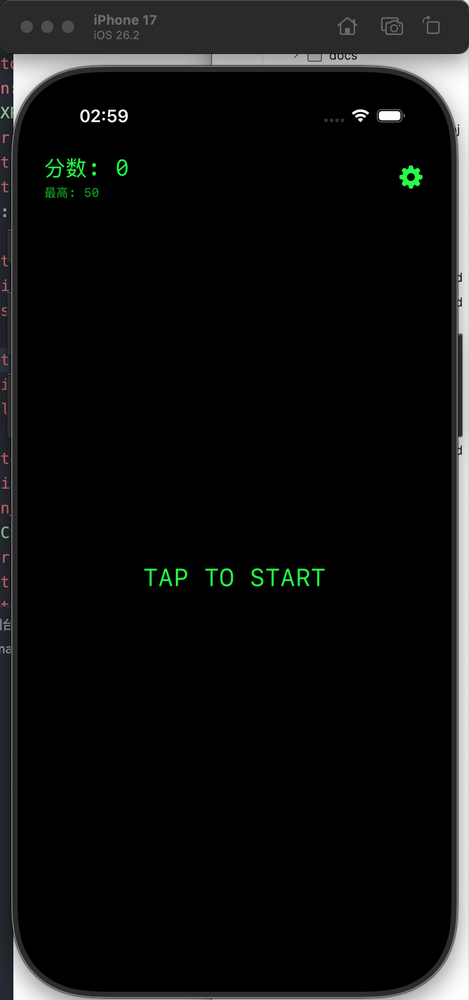
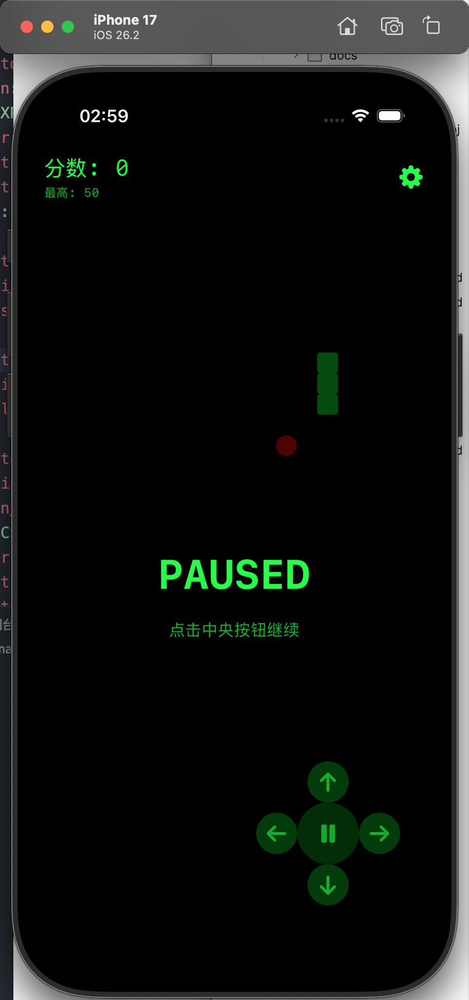

# 🐍 SnakeGame - 复古像素风贪吃蛇游戏

一个使用 SwiftUI 开发的复古像素风贪吃蛇游戏，采用 MVVM 架构模式。

## 📸 游戏截图

<p align="center">
  
  
</p>

## ✨ 特性

- 🎮 **复古像素风设计** - 绿屏终端主题，荧光绿蛇身 + 红色食物
- 📱 **原生 SwiftUI** - 100% Swift 原生实现，无第三方依赖
- 🏗️ **MVVM 架构** - 清晰的代码分层，易于维护和扩展
- ✅ **测试驱动开发** - 11 个单元测试覆盖核心逻辑
- 🎯 **滑动手势控制** - 流畅的上下左右滑动操作
- 🔄 **完整游戏循环** - 碰撞检测、分数计算、游戏状态管理

## 🚀 快速开始

### 前置要求

- macOS 13.0+
- Xcode 14.0+
- iOS 15.0+ 设备或模拟器

### 创建 Xcode 项目

1. 打开 Xcode
2. **File → New → Project → iOS → App**
3. 配置项目:
   - Product Name: `SnakeGame`
   - Interface: `SwiftUI`
   - Language: `Swift`
4. 保存到: `/Users/drew/test/ios-snake`
5. 删除自动生成的 `ContentView.swift`
6. 将 `SnakeGame/` 和 `SnakeGameTests/` 文件夹拖入项目
7. 设置 Minimum Deployment 为 iOS 15.0
8. 按 **Cmd+R** 运行

详细步骤请参考 [QUICK_START.md](QUICK_START.md)

## 🎮 游戏玩法

- **开始游戏**: 点击屏幕
- **控制方向**: 上下左右滑动屏幕
- **目标**: 吃食物（红色圆点）让蛇变长
- **规则**: 避免撞墙或撞到自己
- **得分**: 每吃一个食物 +10 分

## 📁 项目结构

```
ios-snake/
├── SnakeGame/
│   ├── App/                    # 应用入口
│   │   └── SnakeGameApp.swift
│   ├── Models/                 # 数据模型
│   │   ├── Point.swift         # 坐标点
│   │   ├── Direction.swift     # 移动方向
│   │   └── GameState.swift     # 游戏状态
│   ├── ViewModels/             # 业务逻辑
│   │   └── GameViewModel.swift
│   ├── Views/                  # 用户界面
│   │   ├── GameView.swift      # 主界面
│   │   ├── GridView.swift      # 网格渲染
│   │   └── Components/         # UI 组件
│   └── Utilities/              # 工具类
│       └── Color+Hex.swift     # 颜色扩展
└── SnakeGameTests/             # 单元测试
    ├── PointTests.swift
    ├── DirectionTests.swift
    └── GameViewModelTests.swift
```

## 🧪 运行测试

在 Xcode 中按 **Cmd+U** 运行所有测试。

或使用命令行（需要 Swift Package）:

```bash
swift test
```

## 🎨 设计理念

### 视觉风格

- **绿屏终端主题** - 纯黑背景 (#000000) + 荧光绿 (#00FF00)
- **无网格线设计** - 简洁现代的像素风
- **轻微圆角** - 蛇身方块 3px 圆角，食物为圆形
- **等宽字体** - 分数和提示使用 SF Mono

### 技术栈

- **SwiftUI** - 声明式 UI 框架
- **Combine** - 响应式编程（游戏循环）
- **MVVM** - Model-View-ViewModel 架构
- **XCTest** - 单元测试框架

## 📋 开发进度

### Phase 1: 核心游戏逻辑 ✅

- ✅ 项目基础结构
- ✅ 数据模型（Point, Direction, GameState）
- ✅ GameViewModel 核心逻辑
- ✅ 基础 UI 渲染（GridView）
- ✅ 滑动手势控制
- ✅ 碰撞检测和游戏循环
- ✅ 游戏状态提示 UI
- ✅ 单元测试

### Phase 2: UI/UX 完善 🔜

- ⏳ 虚拟十字键控制
- ⏳ 游戏状态动画
- ⏳ GameBoy 主题支持
- ⏳ 设置页面（主题切换）

### Phase 3: 音效与反馈 🔜

- ⏳ 8-bit 音效集成
- ⏳ 触觉反馈
- ⏳ 最高分记录

## 📚 文档

- [快速启动指南](QUICK_START.md) - 3 分钟上手
- [完整设置指南](SETUP_INSTRUCTIONS.md) - 详细步骤说明
- [项目状态报告](PROJECT_STATUS.md) - 当前进度和下一步
- [设计文档](docs/plans/2026-01-12-ios-snake-design.md) - 完整设计方案
- [实现计划](docs/plans/2026-01-12-phase1-implementation.md) - Phase 1 详细实现
- [项目规范](CLAUDE.md) - 开发规范和架构约束

## 🛠️ 开发原则

- **KISS** - 选择最简单直接的实现方式
- **YAGNI** - 严格按 Phase 分阶段开发，不提前实现
- **DRY** - 主题配置统一管理，UI 组件复用
- **SOLID** - 单一职责，依赖倒置

## 🤝 贡献

这是一个学习项目，目标是演示 SwiftUI + MVVM + TDD 的最佳实践。

## 📄 许可

MIT License

## 👨‍💻 作者

Created as a learning project for iOS development with SwiftUI.

---

**当前状态**: Phase 1 代码完成，等待 Xcode 项目创建
**下一步**: 在 Xcode 中创建项目并运行验证 → 参考 [QUICK_START.md](QUICK_START.md)
